# Checkmate

Checkmate is an AI-powered mental health companion designed to offer emotional support, reflective guidance, and early interventions for users facing mental stress.
It leverages  the Llama 3.3 70B instruct model from Meta to deliver context-aware mental health responses in multiple languages supporitng USSD for offline and remote people.

---

## Live Links🌐📶

* **🚀Live Link on Vercel:** [hthttps://checkmate-mental-health.netlify.app](https://checkmate-mental-health.netlify.app/)
* **Youtube Video :** [https://youtu.be/your-video-link-here](https://youtu.be/your-video-link-here)

---


---

## 📜 Table of Contents

* [Overview](#overview)
* [Features](#features)
* [System Architecture](#system-architecture)
* [Getting Started](#getting-started)
* [Environment Setup](#environment-setup)
* [Usage](#usage)
* [Gallery](#gallery)
* [Contributing](#contributing)

---

## Overview

This diagram provides an overview of how the Checkmate system works, from user input to delivering AI-powered mental wellness support using the Friendli.ai API and the Llama 3.3 70B instruct model from Meta.

```mermaid
graph TD
    subgraph UserLayer["👤 User Interaction"]
        User[🧑‍🧒 User]
    end

    subgraph Frontend["🎨 Frontend (React.js)"]
        UI[Mental Health Chat Interface]
    end

    subgraph Backend["🌐 Backend (Open API)"]
        API[Friendli.ai API]
    end

    subgraph AIEngine["🤖 AI Processing (Meta)"]
        Llama[Llama 3.3 70B - Mental Health Model]
    end

    subgraph ResponseHandler["⚙️ Response Processing"]
        ToneCheck[🔄 Sentiment & Tone Analysis]
        Reflect[🖋️ Reflective Feedback Generation]
        LangDetect[🌍 Language Detection]
        ErrorHandler[⚠️ Error Handling & Fallback Response]
    end

    User -->|Expresses Emotions| UI
    UI -->|Sends Prompt| API
    API -->|Forwards Request| Llama
    Llama -->|Returns Guidance| API
    API -->|Analyzes Tone| ToneCheck
    API -->|Generates Feedback| Reflect
    API -->|Detects Language| LangDetect
    API -->|Handles Errors| ErrorHandler
    ErrorHandler -->|Fallback Message| API
    API -->|Sends Final Response| UI
    UI -->|Displays Mental Health Guidance| User
```



---

### Explanation:

* **User**: Interacts with the chatbot for mental wellness assistance.
* **Frontend (React.js)**: Hosts the user interface for the AI-powered chatbot.
* **Open API**: Facilitates communication with the Llama 3.3 model.
* **Llama 3.3 70B Model**: Processes mental health prompts and returns emotionally aware responses.

---

* **Flow**:

  1. User enters emotional or mental health concerns in the chatbot.
  2. Frontend sends this to Friendli.ai API.
  3. Friendli.ai forwards request to Llama 3.3 70B model.
  4. Model returns advice and reflective support.
  5. API adds tone and sentiment context.
  6. Language is detected and response is prepared.
  7. Fallback system ensures graceful handling of any failures.
  8. Response is shown to the user in the chat UI.

---

---
## Features

* **Emotional Support Guidance:** Empathetic and structured responses based on input.
* **Reflection Prompts:** Encourages mindfulness and cognitive clarity.
* **Sentiment Analysis:** Detects tone (e.g., stressed, confused, sad) for better response tuning.
* **Multilingual Support:** Supports English, French, Kiswahili, Arabic, and more.
* **Responsive UI:** Cross-device chat experience.
* **Responsive UI:** Cross-device chat experience.
* **Connect with Wallet or Google:** Wallet-based and Google OAuth login options.
* **Journal Storage:** Journals and emails are hashed and securely stored on-chain and in IPFS.
---

## System Architecture

```mermaid
sequenceDiagram
    participant User as 👤 User
    participant Frontend as 🎨 Frontend (React.js)
    participant Backend as 🌐 Backend (Friendli.ai API)
    participant AIEngine as 🤖 AI Engine (Llama 3.3 70B)
    participant Fallback as ⚠️ Fallback Logic
    participant Database as 📂 Database (Storage)

    User->>Frontend: 1. Shares thoughts/concerns
    Frontend->>Backend: 2. Sends user prompt & lang
    Backend->>AIEngine: 3. Request to AI
    AIEngine-->>Backend: 4. Returns emotional guidance
    Backend->>Frontend: 5. Sends AI response
    alt Error detected
        Backend->>Fallback: 6. Invoke fallback
        Fallback-->>Backend: 7. Return default support
    end
    Backend->>Database: 8. Save user feedback (if consented)
    Database-->>Backend: 9. Retrieve past sessions
    Backend->>Frontend: 10. Display history and response
    Frontend->>User: 11. Show reflection and support
```



---

---

## USSD + SMS Flow (Africa's Talking)

```plaintext
1. User Dials USSD Code (e.g. *384*123#)
   ↓
2. Africa’s Talking sends POST to /api/ussd
   ↓
3. Backend processes text menu options and logic
   ↓
4. If needed, send SMS via Africa’s Talking SMS API
   ↓
5. Backend responds with USSD (CON or END)
   ↓
6. User sees message and receives SMS with support content
```
--- 


### Sample SMS Payload:

```ts
await axios.post(
  'https://api.africastalking.com/version1/messaging',
  qs.stringify({
    username: 'your_AT_username',
    to: '+254712345678',
    message: 'Thank you for reaching out. Try breathing deeply, and call 1195 for support.',
    bulkSMSMode: 1,
  }),
  {
    headers: {
      'Content-Type': 'application/x-www-form-urlencoded',
      'apiKey': process.env.AT_API_KEY,
    }
  }
);
```

---

## Getting Started

### Prerequisites

* Node.js and npm installed
* A Friendli.ai API token
* Africa’s Talking API Key

---

### Installation

1. Clone the repository:

```bash
git clone https://github.com/your-repo/checkmate
cd checkmate
```

2. Install dependencies:

```bash
npm install
```

---

## Environment Setup

Create a `.env` file in the root directory and add:

```bash
Open_AI=your_friendli_api_key
```

**Start the development server:**

```bash
npm run dev
```

---

## Usage

1. Open the chat page `/chat` in your browser.
2. Type your feelings or mental health concerns.
3. Select your preferred language.
4. Read through AI-generated reflective responses.
5. Optionally, follow up for more insights.
6. Use USSD code to access via mobile.
7. Receive support via SMS if applicable.

---
## Web application Gallery


<br>

<br>

<b3>


### Journals


<br>


### Learn 


---

## USSD Gallery Using Africa's Talking API


<br>


<br>


---

## Contributing

Contributions are welcome! Open issues or submit pull requests to help improve Checkmate.
